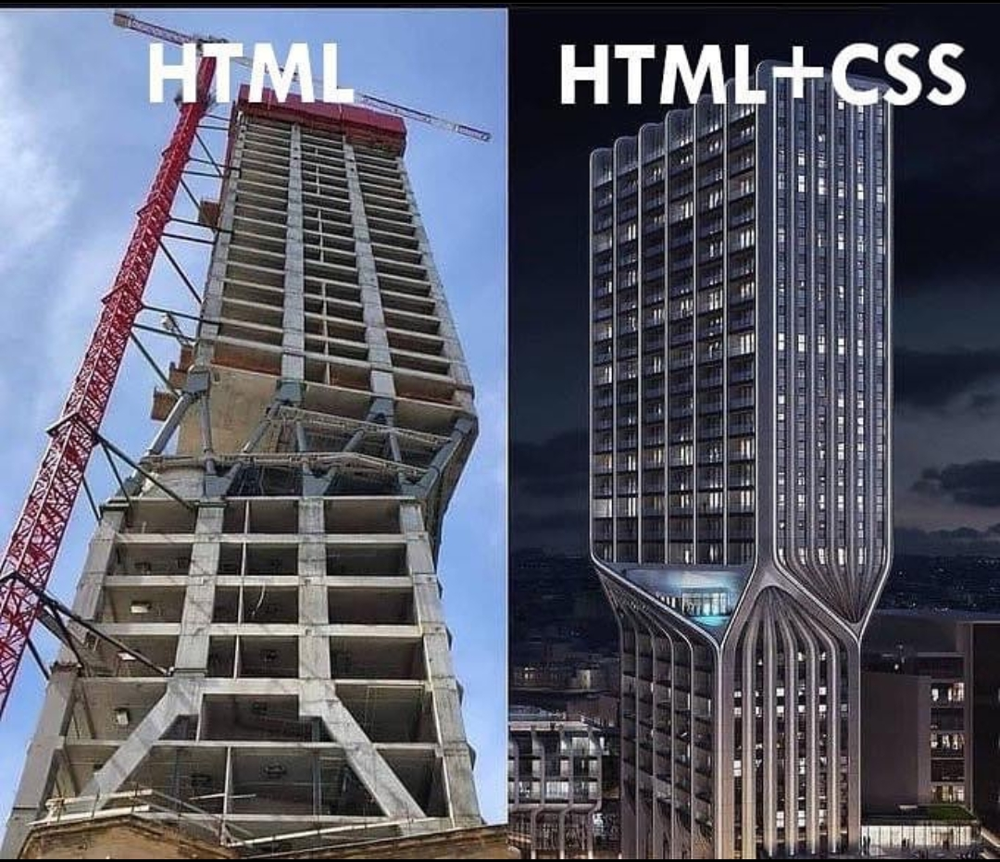

# The Complete FrontEnd Development
## Day 1

---

# Who am I?

## Bhupendra Singh Parihar
*Director of Application & Curriculum at SkillLync | Fullstack Developer*
*I Love : Programming | Physics | Poetry*

---


---

# Tim Berners Lee


> Creator of the World Wide Web who developed many of the principles we still use today, such as HTML, HTTP, URLs and web browsers.

---


> Inventors of DNS, the ‘phone book of the internet’.

---
# Marc Andressen


> Inventor of Mosaic, the first widely-used web browser.

---

### Contents
+ How website works
+ Client Server Model
+ Create a simple webpage
+ Understand
    + HTML
    + CSS
    + JavaScript

---
## How WebSite works
1. You type www.skill-lync.com into the address bar of your browser.
2. The browser checks the cache for a DNS record to find the corresponding IP address of www.skill-lync.com (This is called as DNS looking)
    + browser cache
    + os cache
    + router cache
    + ISP cache

 > A cache is a special storage space for temporary files that makes a device, browser, or app run faster and more efficiently.

---
3. If the requested URL is not in the cache, ISP’s DNS server initiates a DNS query to find the IP address of the server that hosts www.skill-lync.com

4. The browser initiates a TCP connection with the server.
    > This connection is established using a process called the TCP/IP three-way handshake. This is a three-step process where the client and the server exchange SYN(synchronize) and ACK(acknowledge) messages to establish a connection.

---
### Three way handshake
1. The client machine sends a SYN packet to the server over the internet, asking if it is open for new connections.

2. If the server has open ports that can accept and initiate new connections, it’ll respond with an ACKnowledgment of the SYN packet using a SYN/ACK packet.

3. The client will receive the SYN/ACK packet from the server and will acknowledge it by sending an ACK packet.

Then a TCP connection is established for data transmission!

---
5. The browser sends an HTTP request to the webserver.

6. The server handles the request and sends back a response (This is responsibility of Backend, what to return, and in what format)

7. The server sends out an HTTP response
    ```
    Request URL: https://skill-lync.com/
    Request Method: GET
    Status Code: 200 
    Remote Address: 104.26.2.172:443
    Referrer Policy: strict-origin-when-cross-origin
    age: 57800
    cache-control: s-maxage=31536000, stale-while-revalidate
    cf-cache-status: DYNAMIC
    cf-ray: 71c2ab630f871be7-DEL
    content-encoding: br
    content-type: text/html; charset=utf-8
    date: Thu, 16 Jun 2022 09:55:22 GMT
    ```

---
8. The browser displays the HTML content

    >The browser displays the HTML content in phases. First, it will render the bare bone HTML skeleton. Then it will check the HTML tags and send out GET requests for additional elements on the web page, such as images, CSS stylesheets, JavaScript files, etc. These static files are cached by the browser, so it doesn’t have to fetch them again the next time you visit the page. In the end, you’ll see www.skill-lync.com appearing on your browser.

---

## Latency vs Throughput

Latency is the time required to perform some action or to produce some result. Latency is measured in units of time -- hours, minutes, seconds, nanoseconds or clock periods.

Throughput is the number of such actions executed or results produced per unit of time. This is measured in units of whatever is being produced (cars, motorcycles, I/O samples, memory words, iterations) per unit of time. The term "memory bandwidth" is sometimes used to specify the throughput of memory systems.

---

## Latency vs Throughput

A simple example

The following manufacturing example should clarify these two concepts:

An assembly line is manufacturing cars. It takes eight hours to manufacture a car and that the factory produces one hundred and twenty cars per day.

The latency is: 8 hours.

The throughput is: 120 cars / day or 5 cars / hour.

---

### Client Side

>The source code of a website can be broken down into two parts: client-side and server-side. 

>The code on the ‘client’ side runs on the client computer’s browser and handles what the website looks like, how it requests data from the server, and how it interacts with temporary and local storage on the client machine. 

>This includes but is not limited to selecting and styling user interface components, creating layouts, navigation, form validation, and cache handling

We will see these concepts in more details

---

''

---
## Anatomy of a HTML page 

```html
<!DOCTYPE html>
<html lang="en">
<head>
    <meta charset="UTF-8">
    <meta http-equiv="X-UA-Compatible" content="IE=edge">
    <meta name="viewport" content="width=device-width, initial-scale=1.0">
    <title>A Basic Web Page</title>
</head>
<body>
    <h1>My First HTML File</h1>
    <p>Congratulations! You're well on your way to creating your own web pages.</p>
  </body>
</html>
```

Try it out. 

---
## Interview Question

### What is doctype in html page?
>The first line, <!DOCTYPE html>, is referred as a doctype declaration. This is used to indicate to a browser what HTML version the file is written in. For this file, specifying html indicates that the file is written in HTML5.

---

## <head> tag
The <head> element contains supporting information about the file, commonly referred to as metadata. 

There must be a <title> (providing the webpage a title) directly underneath the <head> element in order be complete. 

The <head> element may also contain links to Javascript files and CSS stylesheets.

---
## container tags

+ div
+ section
+ header
+ footer
+ main
+ nav

---

## Inteview Question

> What are semantic tags. Why can't I use div everywhere instead of new tags, like header, footer, nav etc.

---
## Understand Box Model
> https://jsbin.com/zowuvem/8/edit?html,css,console,output

---

## How to center a div content using flex ?

> https://jsbin.com/himeqen/edit?html,css,output

> https://jsbin.com/qepukot/edit?html,css,output

---
## image tag

```html

```
---
## HTML table

```html
<table>
    <tbody>
        <tr>
            <td>Tom</td>
            <td>Hanks</td>
        </tr>
    </tbody>
</table>
```
We can easily design the layout using HTML Table, but it is not recomended because it does not make the layout fluid/responsive.

---
Challenge 1 : Create the html structure for Swag Of India web site.
---